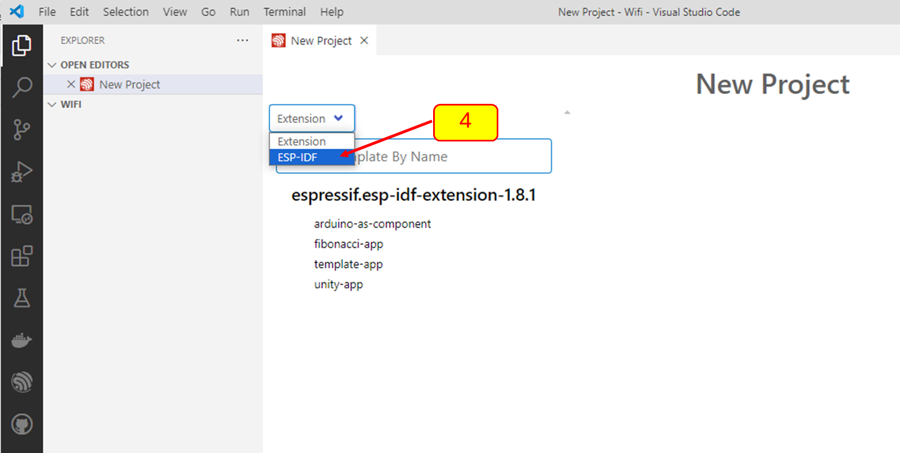
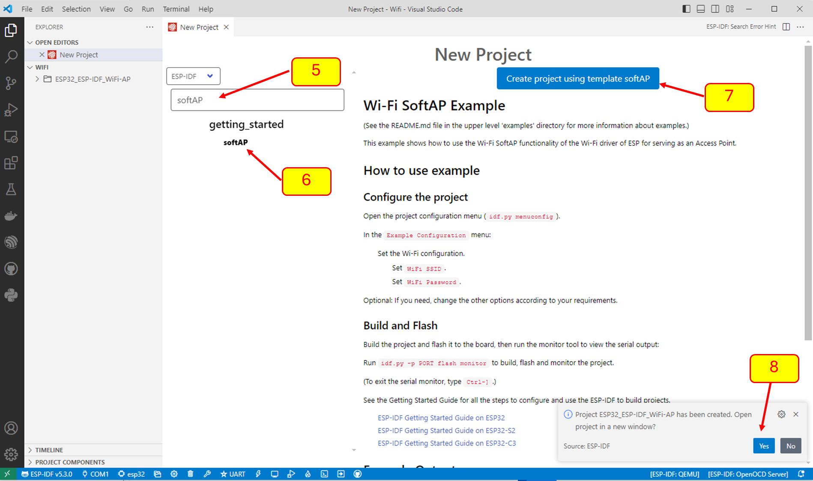
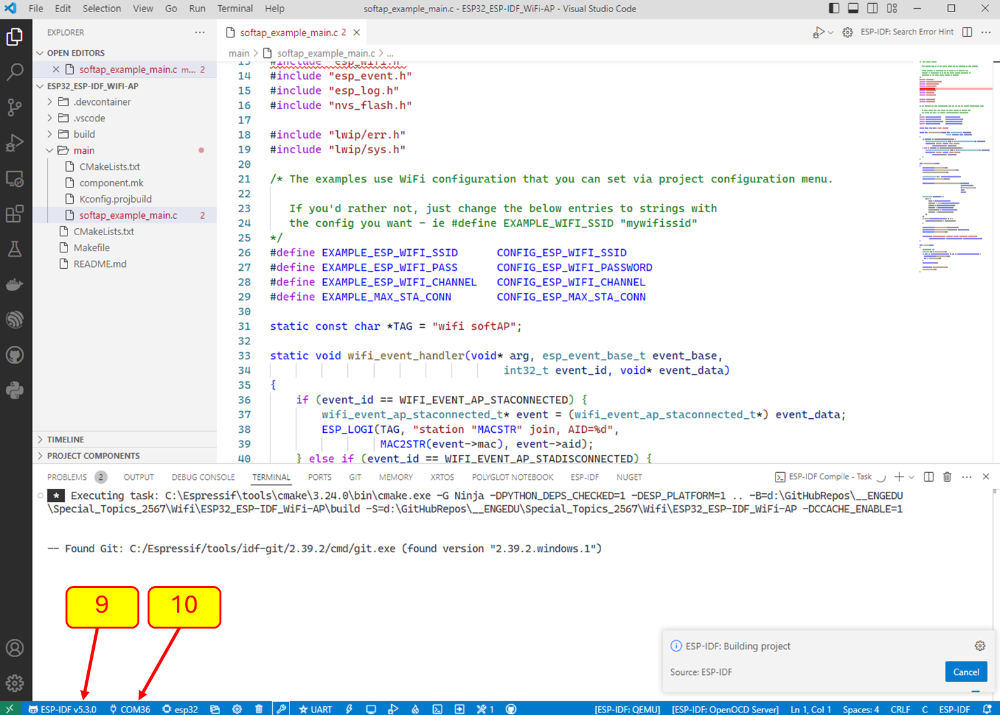
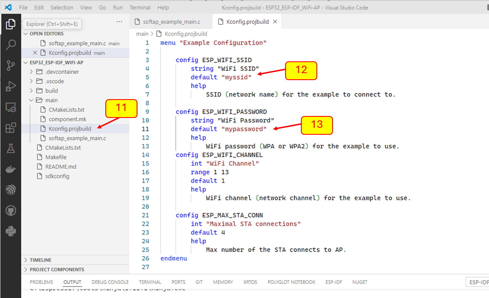
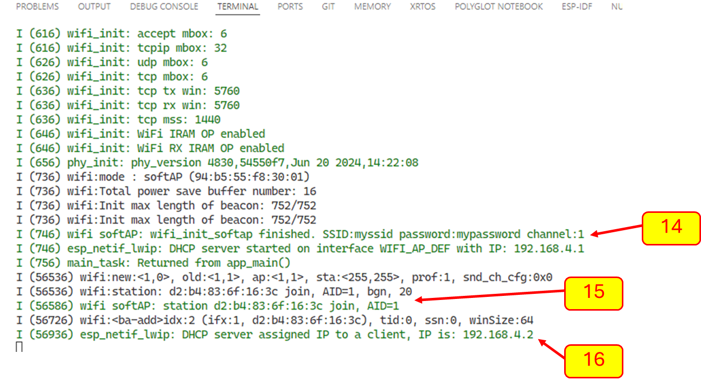
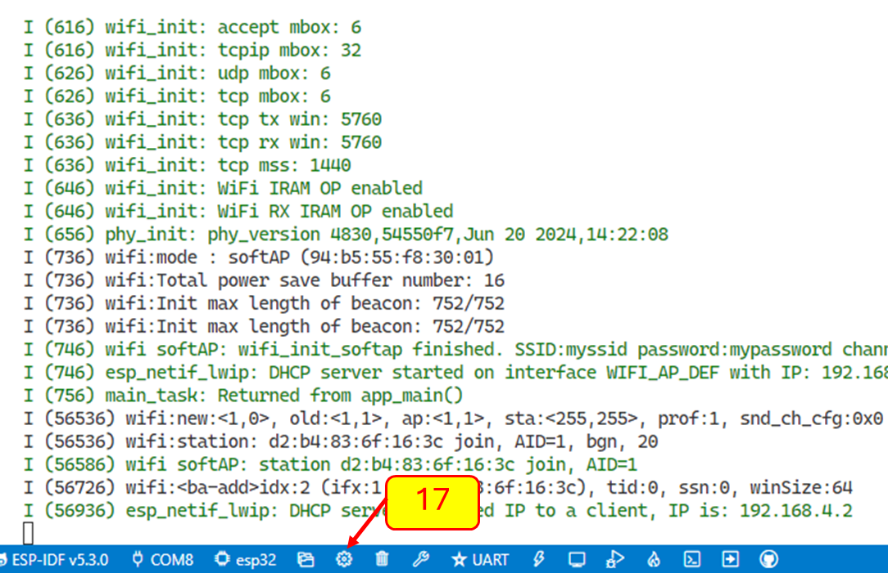

# ใบงานการทดลอง ESP32_ESP-IDF_WiFi-AP

## ขั้นตอนการทดลอง

1. สร้าง Espressif IDF project ใหม่  

  หลังจากใส่ชื่อ คลิก next เพื่อเลือก template project

[1] ตั้งชื่อ  ESP32_ESP-IDF_WiFi-AP 

[2] เลือก folder  ของโปรเจค 

[3] เลือกเทมเพลต 

[4] เลือกตัวอย่างโปรเจค โดยการคลิกเลือก ESP-ISF 

[5] ค้นหาเทมเพลต พิมพ์ `softAP`

[6] เลือก `softAP`

[7] คลิก

[8] ตอบ `Yes`

 

[9] ยืนยันว่าเลือกรุ่นของ idf เป็น V5.3  ขึ้นไป

### 2. แก้ไขไฟล์ config

2.1 เปิดไฟล์ Kconfig.projbuild  ในโฟลเดอร์ main ด้วย text editor

[11] เปิด Kconfig.projbuild
 
[12] เปลี่ยนชื่อของ wifi ssid

[13] เปลี่ยน password

ทั้งชื่อและ password จะใช้ตอนค้นหาและเชื่อมกับ access point

### หมายเหตุ 

ควรแก้ไข SSID  ให้มีความแตกต่างจากของเพื่อน เช่นใส่เลข 3 ตัวท้ายของรหัสนักศึกษากำกับไว้ เช่น `"SSID-001"` เป็นต้น

อาจจะแก้ password ตามต้องการ

หมายเหตุ  สามารถแก้  ssid กับ password ได้ภายหลังจากการเรียก sdkconfig หรือ menuconfig (ทำในข้อท้ายของใบงาน)

### 3. Build โปรเจค

ถ้ามีที่ผิดเนื่องจาก MACSTR แสดงว่า idf รุ่นที่ใช้ไม่มี macro ดังกล่าวให้แก้ไขตามนี้ [แก้ไข error จาก MACSTR](./code_correction.md)

### 4. Run โปรเจค ดูผลจาก Terminal

### 5. ใช้ Laptop หรือ Smartphone ค้นหา Accesspoint 

ควรจะต้องเจอ `"SSID-..."` ในรายการ Wifi ที่เราสร้างขึ้น

[14] จะปรากฏชื่อ ssid และ password ใน esp terminal และต้องมีชื่อเดียวกันในรายการ wifi ที่พร้อมรับการเชื่อมต่อ

ให้เชื่อม wifi โดยเลือก ssid และใส่ password ที่ถูกต้อง

[15] ถ้าเชื่อมต่อได้สำเร็จ จะมีข้อความปรากฏ (จาก source code บรรทัดใด) 

[16] smartphone หรือ laptop จะได้ ipaddress  และอาจจะมีคำเตือนว่าไม่สามารถเชื่อมต่ออินเทอร์เน็ตได้  (เนื่องจาก ESP ที่ใช้ไม่ได้ต่อกับ internet นั่นเอง) 

### 6. บันทึกผลการทดลอง 

ทั้งที่หน้าจอ Laptop หรือ Smartphone และที่ terminal ของ ESP32

รวมทั้งหน้าจอ properties ของ wifi ดังตัวอย่าง

### 7. ทดลองแก้ไข ssid และ  password

[17] คลิกที่สัญลักษณ์รูปเฟือง เพื่อเรียก menuconfig

[18] ในช่อง search ให้ใส่ข้อความ ssid

[19] เปลี่ยนชื่อ access point  ที่จะให้ปรากฏในรายการ access point ของ laptop หรือ  smartphone

[20] save 

[21] ค้นหา password สำหรับ AP โดยพิใพ์ pass แล้วมองหา `Wifi password`

[22] เปลี่ยน password ตามต้องการ

[23] save 

[24] ssid ที่เห็นในรายการ access point list จะเปลี่ยนไป

[25] ทดสอบใส่ password เดิม หรือในกรณีที่ยังไม่เปลี่ยน ให้ทดลองใส่ password ผิด สังเกตุและอธิบายสิ่งที่ได้

[26] ทดสอบใส่ password ที่ถูกต้อง  สังเกตุและอธิบายสิ่งที่ได้

[27] ทดสอบตัดการเชื่อมต่อจาก wifi accesspoint ที่สร้างจาก ESP32 สังเกตุและอธิบายสิ่งที่ได้

### 8. ส่งงาน

โดยการ pull request พร้อมแนบ link ไปยัง Repository ของโปรเจคมาด้วย
