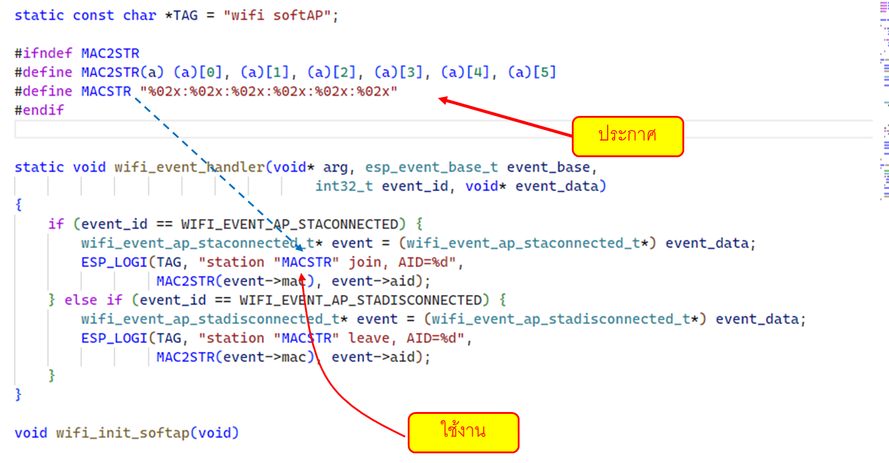

# แก้ code ที่ผิด คอมไพล์ไม่ผ่าน

ถ้าเกิด error ที่ MAC2STR ให้เพิ่ม  code ต่อไปนี้ไว้ด้านบนฟังก์ชัน `static void wifi_event_handler(void* arg, esp_event_base_t event_base, int32_t event_id, void* event_data)`

เมื่อเพิ่มแล้วขจะได้โปรแกรมดังตัวอย่างต่อไปนี้

